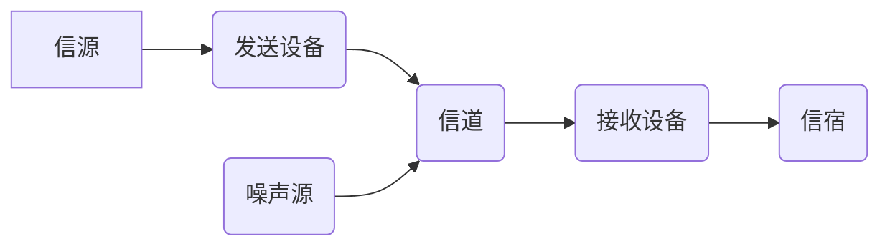

移动通信基础的学习笔记

<!-- more -->

## 第一代移动通信（1G)

**采用模拟技术的语言移动通信，提供9.6Kbit/s的通信带宽，接入技术采用FDMA。**

### 缺点

```
- 频谱利用率低
- 系统容量有限
- 抗干扰能力差
- 标准不统一，跨国漫游困难
- 没有数字业务，不能与综合业务数字网(ISDN)兼容。
```


## 第二代移动通信（2G）

**采用数字技术的移动通信，以语音为主，低速数据传输。提供9.6Kbit/s~28.8Kbit/s的传输速率，接入技术是TDMA，CDMA。**

### 优点

```
相比1G具有保密性强，频谱利用率高，标准化程度高的特点。
```

### 缺点

```
- 系统带宽有限，限制了数据业务的发展
- 无法实现多媒体业务
- 各国标准不统一，无法实现全球漫游。
```

### 2G代表系统

```
TDMA体制：欧洲的全球移动通信系统（GSM）等

CDMA体制：美国的CDMA系统
```


## 第三代移动通信（3G）

采用CDMA技术和分组交换技术。提供9.6Kbit/s~2Mbit/s的接入速率。

### 优点

```
相对2G频谱利用率高，性能更好；提供移动多媒体业务；3G支持漫游。
```

### 3G代表系统

```
美国：CDMA2000

欧洲和日本：WCDMA

中国：TD-SCDMA
```

**2009年1月中国“信息产业部”发下了3张3G牌照，将3G的三大标准分别分配给：**

```
中国移动：TD-SCDMA

中国联通：WCDMA

中国电信：CDMA 2000
```


## 第四代移动通信（4G）

提供2~20Mbit/s。

### 提高传输速率的主要技术：

```
OFDM：正交频分复用

SA：智能天线技术

MIMO：多输入多输出技术

SDR：软件无线电
```


## 第五代移动通信（5G）

### 三大目标场景：

```
- 增强移动带宽：eMBB

- 海量机器通信：mMTC

- 超高可靠低时延通信：URLLC
```


## 通信的概念

```
指人与人或人与自然之间通过某种行为或媒介进行的信息交流与传递，从广义上指需要信息的双方或多方在不违背各自意愿的情况下采用任意方法，任意媒介，将信息从某方准确安全地传送到另方。
```



```
信源：把各种信息转换成原始电信号。信源分为数字信源和模拟信源。
发送设备：产生适合于在信道中传输的信号。
信道：将来自发送端的信号传送到接收端的物理媒介。可分为有线信道和无线信道两大类。
噪声源：集中表示分布于通信系统中各处的噪声。
接收设备：将受到减损的接收信号中正确恢复出原始电信号。
信宿：将原始电信号还原成相应的消息。
```


## 信源

### 模拟信号与数字信号

```
模拟信号：模拟信号是连续的信号。

数字信号：时间上离散的信号，通过电压脉冲的变化来表示要传输的数据
```


### 数字信号的优点

```
（1） 抗干扰能力强，且噪声不积累
（2） 传输差错可控
（3） 便于处理、变换、存储
（4） 便于将来自不同信源的信号综合到一起传输
（5） 易于集成
（6） 易于加密处理，且保密性好
```

### 数字信号的缺点

```
（1） 需要较大的传输带宽
（2） 对同步要求高
```

## 发射设备

### 调制

```
调制的目的是把要传输的模拟信号或数字信号变换成适合信道传输的信号。该信号称为已调信号。调制过程用于发送端。
```

### 解调

```
在接收端将已调信号还原成要传输的原始信号，该过程称为解调。解调过程用于接收端。
```

### 模拟调制

```
利用输入的模拟信号直接调制载波的振幅、频率或相位，从而得到调幅（AM）、调频（FM）或调相（PM）信号。
```

### 数字调制

```
利用数字信号来控制载波的振幅、频率或相位。
```

### 常用的数字调制

```
FSK：频移键控
PSK：相移键控
```


## 信道

```
将来自发送设备的信号传送到接收端的物理媒介。分为有线信道和无线信道。
```

### 信道的基本特征

```
(1) 带宽有限，它取决于可使用的频率资源和信道的传播特性。
(2) 干扰和噪声大，这主要是移动通信工作的电磁环境所决定。
(3) 存在多径衰落。
```

**针对信道的特点，已调信号应具有高的<red>频谱利用率</red>和<red>较强的抗干扰、抗衰落</red>的特点。**

## 噪声与干扰

```
除有用信号以外的一切无用信号，一般把系统内部产生的无用信号称作噪声，系统外部引入的无用信号称作干扰。
```

## 信号损耗

### 无线链路损耗

**典型：自由空间传输损耗**

**[Lfs](dB)=32.44+20lgd(D)+20lgf(F)**

- **Lfs：传输损耗**
- **F：频率（MHz）**
- **D：距离（KM）**


## 脉冲编码调制（PCM）

### 抽样

```
对模拟信号进行周期性扫描，把时间上连续的信号变成时间上离散的信号，抽样必须遵循奈奎斯特抽样定理。该模拟信号经过抽样后还应当包含原信号中所有信息，也就是说能无失真的恢复原模拟信号。它的抽样速率的下限是由抽样定理确定的。抽样速率采用8KHZ。
```

### 量化

```
把经过抽样得到的瞬时值将其幅度离散，即用一组规定的电平，把瞬时抽样值用最接近的电平值来表示,通常是用二进制表示。
```

### 编码

```
用一组二进制码组来表示每一个有固定电平的量化值。然而，实际上量化是在编码过程中同时完成的，故编码过程也称为模/数变换，可记作A/D。
```

## 调制技术

### BPSK

```
二进制相移键控(Binary Phase Shift Keying，BPSK)是把模拟信号转换成数据值的转换方式之一，利用偏离相位的复数波浪组合来表现信息键控移相方式。BPSK使用了基准的正弦波和相位反转的波浪，使一方为0，另一方为1，从而可以同时传送接受2值(1比特)的信息。
```

### QPSK

```
正交相移键控（Quadrature Phase Shift Keying，QPSK）是一种数字调制方式。它分为绝对相移和相对相移两种。由于绝对相移方式存在相位模糊问题，所以在实际中主要采用相对移相方式DQPSK。
```

### 8PSK

```
8PSK (8 Phase Shift Keying 8移相键控) 是一种相位调制算法。相位调制（调相）是频率调制（调频）的一种演变，载波的相位被调整用于把数字信息的比特编码到每一次相位改变（相移）。
```

### 16QAM

```
16QAM全称正交幅度调制是英文Quadrature Amplitude Modulation的缩略语简称，意思是正交幅度调制，是一种数字调制方式。产生的方法有正交调幅法和复合相移法
```

### 64QAM

```
64QAM，Quadrature Amplitude Modulation，指的是相正交振幅调制。
```


## 多址技术

### 频分多址

```
频分复用（FDM）是指载波带宽被划分为多种不同频带的子信道，每个子信道可以并行传送一路信号的一种技术。频分复用技术下，多个用户可以共享一个物理通信信道，该过程即为频分多址复用（FDMA）。FDMA 模拟传输是效率最低的网络，这主要体现在模拟信道每次只能供一个用户使用，使得带宽得不到充分利用。
```

### 时分多址

```
允许多个用户在不同的时间片（时隙）来使用相同的频率。用户迅速的传输，一个接一个，每个用户使用他们自己的时间片。
```

### 码分多址

```
码分多址(CDMA)的基本思想是靠不同的地址码来区分的地址。每个配有不同的地址码，用户所发射的载波(为同一载波)既受基带数字信号调制，又受地址码调制，接收时，只有确知其配给地址码的接收机，才能解调出相应的基带信号，而其他接收机因地址码不同，无法解调出信号。
```

### 正交频分复用

```
将信道分成若干正交子信道，将高速数据信号转换成并行的低速子数据流，调制到在每个子信道上进行传输。正交信号可以通过在接收端采用相关技术来分开，这样可以减少子信道之间的相互干扰 ICI。每个子信道上的信号带宽小于信道的相关带宽，因此每个子信道上的可以看成平坦性衰落，从而可以消除符号间干扰。
```


## 多天线技术

### SISO

**单发单收**

### SIMO

**分集接收**

### Beanforming

**波束赋形**

### MIMO

**多进多出（STC，SM）**